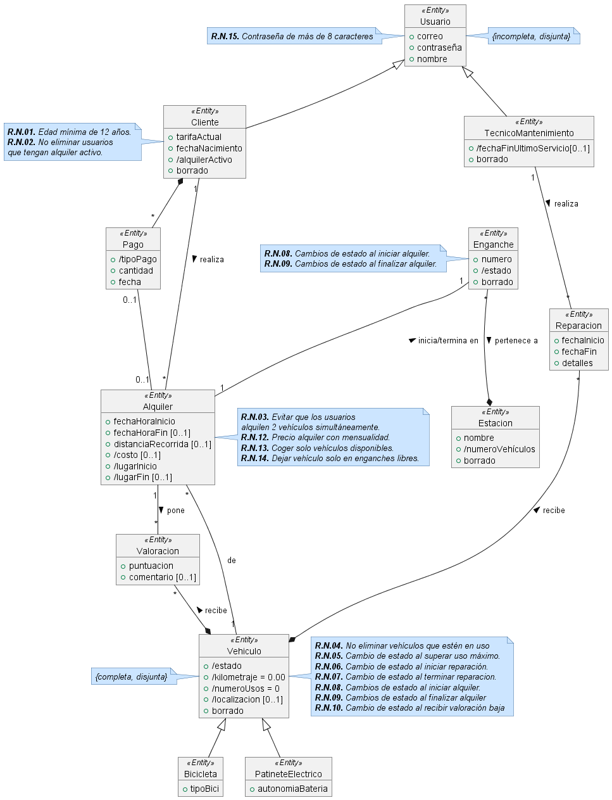
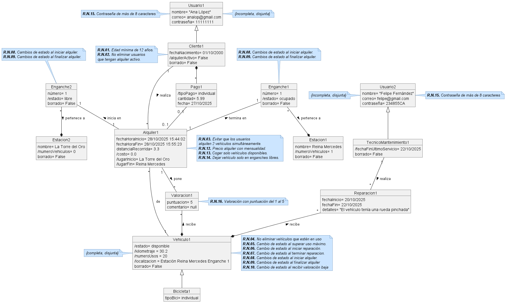

# Título Proyecto

## Miembros del grupo L6-VVF2245

1. Flores Cañabate, Julián
1. Hernández Cuadrado, Luis
1. Noguera Talavera, Sergio
1. Bader Abuhar, Morad

## 1. Introducción al problema

- Descripción del problema para poner en contexto el proyecto, incluyendo información sobre los clientes y usuarios, la situación actual, problemas, expectativas, etc. Se valorará la presencia de información multimedia (fotos, gráficos, documentos escaneados, etc.).

EasyVPM es una empresa dedicada al alquiler de vehículos de movilidad personal que actualmente gestiona los alquileres de forma manual, mediante papeleo y procesos poco eficientes.
Ante su crecimiento, la empresa busca modernizarse implantando una plataforma centralizada que facilite la gestión de usuarios, vehículos y estaciones.
Además, EasyVPM quiere mejorar su imagen y atraer nuevos clientes mediante una aplicación sencilla, moderna y fácil de usar, que ofrezca una experiencia ágil tanto para la empresa como para los usuarios.

 
<em>Objetivo de EasyVPM</em>

## 2. Glosario de términos

**Incidencia:** Registro de un fallo o anomalía detectada en un vehículo o estación, que requiere revisión o intervención por parte del equipo técnico.   
**Mantenimiento pendiente:** Estado en el que se encuentra un VMP cuando ha alcanzado el nº de kilómetros o viajes definidos entre mantenimientos, indicando que requieren una revisión antes de continuar en servicio.  
**Redistribución:** Movimiento de VMPs entre estaciones para equilibrar la disponibilidad.   
**Reseña:** Evaluación proporcionada por un usuario sobre su experiencia con un vehículo mediante calificación y comentario.   
**Tiempo de espera:** Tiempo mínimo que tiene que pasar entre cada viaje.   
**Tipo de tarifa:** Clasificación del modo de pago, que puede ser por suscripción (mensual, anual) o por pago individual de cada trayecto.   
**VMP (Vehículo de Movilidad Personal):** Medio de transporte ligero, destinado a una sola persona (patinetes, monociclos, etc.).   
**Zona de cobertura:** Área geógrafica dentro de la cual el servicio está disponible y se pueden realizar alquileres. 

 
<em>Estación de EasyVPM</em>

 
<em>Reseña de EasyVPM</em>

## 3. Visión general del sistema

### 3.1. Requisitos generales

#### R.G.0.1 Gestión de cuentas
Como administrador de EasyVPM, 
quiero que el sistema gestione y almacene información de los usuarios, 
para poder identificar y administrar adecuadamente a quienes utilizan la plataforma.

#### R.G.02. Gestión integral de la flota de vehículos
Como administrador del sistema, 
quiero gestionar la información y el estado de los vehículos registrados en la plataforma, 
para mantener actualizada y controlada la flota disponible para el servicio.

#### R.G.03. Gestión de estaciones
Como administrador del sistema, 
quiero que se gestionen las estaciones y sus enganches asociados, 
para controlar la disponibilidad y distribución de los vehículos en cada ubicación.

#### R.G.04. Gestión del proceso de alquiler
Como usuario del sistema, 
quiero realizar el proceso completo de alquiler y devolución de vehículos, 
para poder utilizar el servicio de movilidad de forma autónoma.

#### R.G.05. Gestión de pagos
Como usuario del sistema, 
quiero realizar los pagos de mis alquileres y que el sistema registre dicha información, 
para garantizar que mis transacciones quedan correctamente reflejadas.

#### R.G.06. Mantenimiento de los vehículos
Como técnico de mantenimiento de EasyVPM, 
quiero que el sistema registre información sobre las reparaciones efectuadas en los vehículos, 
para asegurar un seguimiento adecuado de su estado y funcionamiento.

#### R.G.07 Valoraciones de los vehículos
Como usuario del sistema, 
quiero poder valorar los vehículos tras su uso, 
para contribuir a informar sobre su estado y ayudar a detectar incidencias.

### 3.2. Usuarios del sistema

El sistema de EasyVPM contará con los siguientes tipos de usuarios: 

**Clientes**
   * Se registran para alquilar vehículos, consultar estaciones y disponibilidad, iniciar y finalizar alquileres, y proporcionar valoraciones. 

**Administradores**
   * Gestionan usuarios, vehículos y estaciones, supervisan incidencias y mantenimiento, y generan informes para la empresa. 

**Técnicos de mantenimiento**
   * Reciben notificaciones de incidencias, actualizan el estado de los vehículos y realizan reparaciones. 
   
## 4. Catálogo de requisitos

### 4.1. Requisitos funcionales

#### R.F.1.01. Registro de usuario
Como administrador de EasyVPM,  
quiero que mis clientes y técnicos de mantenimiento se puedan registrar al sistema, 
para poder acceder al servicio de alquiler.

**P.A.01.**
- El registro solicita nombre, correo, contraseña
- Si la cuenta corresponde a un cliente, también deberá proporcionar su fecha de nacimiento.
- Se comprueba que la contraseña tiene más de 8 dígitos.
- El sistema verifica que el correo no esté duplicado.
- Se envía un correo de confirmación al completar el registro.
- Se debe aplicar la regla de negocio R.N.01.
- Se debe alicar la regla de negocio R.N.15.

#### R.F.1.02. Eliminación de la cuenta
Como cliente de EasyVPM,  
quiero poder eliminar mi cuenta asi como mis datos asociados, 
para poder tener control sobre mi informacion personal y asegurar mi privacidad.

**P.A.1.02**
- El cliente le da al boton de eliminar cuenta dentro de la seccion: Mi cuenta.
- El sistema le mandara un código de autenticación a su correo asociado.
- Si no le llega puede solicitar que se lo reenvien otra vez.
- El cliente pondrá el código correspondiente en la aplicacion.
- Si coincide se le pondra el mensaje "Eliminacion completada" y el sistema borrara su cuenta y datos.
- Si no, le saldra mensaje de error y se le pedirá de nuevo el código.
- En el sistema realmente se hace un soft delete y se activa la cuenta como "borrada" para no tenerla en cuenta para las estadísticas ni recuentos.
- Se debe aplicar la regla de negocio R.N.02.

#### R.F.1.03. Actualización de datos de la cuenta
Como usuario de EasyVPM, 
quiero poder modificar mis datos personales desde mi perfil, 
para mantener mi información actualizada y correcta en el sistema.

**P.A.1.03**
- El usuario selecciona la opción editar perfil en la seccion: Mi cuenta.
- Si el usuario es cliente, también puede actualizar la fecha de nacimiento y su tarifa contratada.
- Si el usuario modifica el correo electrónico, el sistema envía un código de verificación al nuevo correo.
- Si el usuario modifica la contraseña, el sistema exige que tenga al menos 8 caracteres.
- Los cambios no se guardan hasta que el usuario confirme.
- Si el correo introducido ya existe en otra cuenta, el sistema muestra un mensaje indicando que está duplicado.
- Al completar la actualización, el sistema muestra el mensaje "Datos actualizados correctamente"
- Se debe aplicar la regla de negocio R.N.01.
- Se debe aplicar la regla de negocio R.N.15.

#### R.F.1.04. Recuperación de contraseña
Como cliente de EasyVPM, 
quiero poder recuperar mi contraseña si la olvido, 
para no perder el acceso a mi cuenta.

**P.A.1.04.**
- El usuario introduce su correo electrónico registrado y recibe un enlace temporal de autenticación.
- El enlace dura solo 24 horas o hasta utilizarlo.
- El sistema obliga al usuario a establecer una nueva contraseña antes de poder a acceder.

#### R.F.1.05. Consulta de información personal
Como cliente de EasyVPM, 
quiero consultar mis datos personales, 
para verificar que mi información está correcta.

**P.A.1.05.**
- EL usuario accede a la sección Mi cuenta.
- El sistema muestra nombre, correo.
- Si es cliente muestra también fecha de nacimiento, tarifa actual y si tiene algún alquiler activo.
- Si es técnico de mantenimiento muestra además la fecha del último servicio realizado.

#### R.F.2.01. Registro de vehículos
Como administrador de EasyVPM, 
quiero poder registrar nuevos vehículos en el sistema, 
para incorporarlos a la flota disponible para alquiler.

**P.A.2.01**
- Se solicita el tipo de vehículo (bicicleta, patinete eléctrico, ...)
- Se registran los atributos correspondientes
- Para bicicletas: tipoBici
- Para patinetes eléctricos: autonomiaBateria
- Se registran los atributos generales del vehículo: estado inicial, localización, kilometraje inicial, número de usos inicial y borrado = FALSE.
- El sistema le crea automáticamente un identificador único (autoincrement)

#### R.F.2.02 Eliminación de vehículos
Como administrador de EasyVPM, 
quiero poder eliminar vehículos de la flota, 
para mantener actualizada la disponibilidad de la plataforma.

**P.A.2.02**
- El administrador selecciona el vehículo que desea eliminar.
- El sistema comprueba que no esté asociado a un alquiler activo.
- Si no está en uso, se marca como borrado = TRUE (soft delete)
- Si el vehículo tiene alquileres históricos o registros de reparaciones, estos permanecen por si acaso.
- Se debe aplicar la regla de negocio R.N.04.

#### R.F.2.03. Actualización de valores de un vehículo
Como administrador de EasyVPM, 
quiero poder modificar los datos de los vehículos, 
para mantener la información actualizada sobre la flota.

**P.A.2.03.**
- Se selecciona el vehículo a actualizar.
- Se pueden modificar los atributos: estado, localización, kilometraje y número de usos.
- Para las bicicletas, tipoBici y para los patinetes eléctricos, autonomiaBateria.
- El sistema valida que los valores sean consistentes (por ejemplo, kilometraje >=0, número de usos >= o).
- Se actualizan las estaciones y enganches si procede.

#### R.F.2.04. Lista vehículos para mantenimiento
Como técnico de mantenimiento de EasyVPM, 
quiero poder consultar qué vehículos están con estado mantenimiento_pendiente o averiado, 
para poder planificar su revisión y reparación de forma eficiente.

**P.A.2.04.**
- Filtrar vehículos por estado: mantenimiento_pendiente y averiado.
- Mostrar información: id del vehículo, tipo, localización, número de usos, kilometraje.
- Excluir vehículos borrados.
- Permitir ordenar por kilometraje o número de usos para priorizar los vehículos más necesitados de revisión.

#### R.F.2.05. Lista de vehículos disponibles por estación
Como cliente de EasyVPM, 
quiero poder consultar qué vehículos en una estación concreta, 
para poder elegir uno que pueda recoger ahí fácilmente.

**P.A.2.05.**
- Filtrar vehículos por estado: disponible
- Filtrar por la estación seleccionada por el cliente.
- Mostrar información: id del vehículo, tipo (bicicleta o patinete), autonomía (si es patinete), tipo de bicicleta (si es bicicleta) localización exacta
- Excluir vehículos borrados

#### R.F.3.01. Registro de estaciones
Como administrador de EasyVPM, 
quiero poder registrar nuevas estaciones en el sistema, 
para ampliar la cobertura del servicio de alquiler.

**P.A.3.01.**
- Solicitar nombre único de la estación
- Inicializar el número de vehículos a 0.
- Marcar la estación como no borrada.

#### R.F.3.02. Actualización de estación
Como administrador de EasyVPM, 
quiero poder modificar los datos de las estaciones existentes, 
para mantener la información actualizada.

**P.A.3.02.**
- Permitir actualizar nombre y estado de borrado.
- Validar que el nombre no se duplique con otra estación activa.

#### R.F.3.03. Eliminación de estación
Como administrador de EasyVPM, 
quiero poder eliminar estaciones del sistema, 
para mantener la base de datos limpia y solo con estaciones activas.

**P.A.3.03.**
- Marcar la estación como borrada (soft delete).
- Evitar la eliminación si existen enganches con vehículos activos asociados.
- Actualizar automáticamente la disponibilidad de enganches y vehículos asociados.

#### R.F.3.04. Consulta de estaciones
Como cliente de EasyVPM, 
quiero poder consultar todas las estaciones disponibles, 
para saber dónde puedo recoger o devolver un vehículo.

**P.A.3.04.**
- Mostrar información: nombre de la estación, número de vehículos disponibles y localización.
- Excluir estaciones marcadas como borradas

#### R.F.3.05. Registro de enganche
Como administrador de EasyVPM, 
quiero poder registrar nuevos enganches en las estaciones, 
para organizar la colocación de los vehículos.

**P.A.3.05.**
- Solicitar número de enganche dentro de la estación.
- Inicializar estado del enganche como "libre".
- Evitar duplicados de número de enganche en la misma estación.

#### R.F.3.06. Actualización de enganche
Como administrador de EasyVPM, 
quiero poder actualizar el estado de un enganche, 
para reflejar si está ocupado o libre.

**P.A.3.06.**
- Permitir cambiar el estado y la estación asociada.
- Actualizar automáticamente el número de vehículos de la estación asociada.
- Se debe aplicar la regla de negocio R.N.08.
- Se debe aplicar la regla de negocio R.N.09.

#### R.F.3.07. Eliminación de enganche
Como administrador de EasyVPM, 
quiero poder eliminar enganches del sistema, 
para reorganizar la estación y gestionar la disponibilidad de espacios.

**P.A.3.07.**
- Marcar el enganche como borrado (soft delete) en lugar de eliminar del todo.
- Evitar la eliminación si hay un vehículo asignado o un alquiler activo en el enganche.
- Actualizar automáticamente el número de vehículos disponibles de la estación asociada.

#### R.F.3.08. Consulta de enganches
Como cliente de EasyVPM, 
quiero poder consultar los enganches disponibles en una estación, 
para saber dónde puedo dejar un vehículo al finalizar el alquiler.

**P.A.3.08.**
- Mostrar enganches libres por estación.
- Excluir enganches borrados
- Ordenar por número de enganche

#### R.F.4.01. Creación de Alquiler
Como cliente,  
quiero iniciar un alquiler seleccionando un vehículo disponible en una estación, 
para poder usarlo inmediatamente.

**P.A.4.01.**
- El sistema valida que el vehículo esté en estado "disponible".
- Se comprueba que el cliente no tenga otro alquiler activo.
- Se registra fecha y hora de inicio, vehículo, estación de inicio y enganche asociado.
- Se debe aplicar la regla de negocio R.N.03.
- Se debe aplicar la regla de negocio R.N.13.

#### R.F.4.02. Finalización del alquiler
Como cliente de EasyVPM, 
quiero finalizar mi alquiler dejando el vehículo en un enganche libre, 
para cerrar el servicio y que se me cobre lo correspondiente.

**P.A.4.02.**
- El cliente selecciona un enganche libre de la estación donde devuelve el vehículo
- El sistema registra fecha y hora de finalización.
- Se calcula el coste total según la duración y la tarifa activa.
- El vehículo pasa a estado "disponible".
- El enganche donde se deja el vehículo pasa a "ocupado".
- Se genera el pago asociado al alquiler.
- Se debe aplicar la regla de negocio R.N.11.
- Se debe aplicar la regla de negocio R.N.12.
- Se debe aplicar la regla de negocio R.N.14.

#### R.F.4.03. Historial de alquileres
Como cliente de EasyVPM, 
quiero consultar mis alquileres anteriores, 
para revisar mis usos.

**P.A.4.03.**
- Se listan los alquileres realizados del cliente.
- Se muestra vehículo, fecha y hora de inicio, duración y coste total.
- Se permite filtrar por rango de fechas.

#### R.F.4.04. Consulta de vehículos en alquiler
Como administrador de EasyVPM, 
quiero consultar todos los vehículos que están actualmente en uso, 
para monitorear su uso.

**P.A.4.04.**
- Se listan alquileres que no hayan terminado.
- Se muestra cliente, vehículo, estación y enganche de salida, fecha y hora de inicio.
- Se puede filtrar por estación, tipo de vehículo o cliente.

#### R.F.5.01. Registro de pago
Como cliente de EasyVPM, 
quiero poder pagar mi mensualidad de forma manual desde la aplicación, 
para renovar mi tarifa y seguir gozando de sus beneficios.

**P.A.5.01.**
- El cliente accede a la sección de pagos -> mensualidad.
- El sistema muestra el importe de la mensualidad y la fecha de vencimiento.

#### R.F.5.02. Consulta de pagos (cliente)
Como cliente de EasyVPM, 
quiero consultar mis pagos realizados, 
para tener control sobre mis gastos.

**P.A.5.02.**
- Se listan pagos realizados del cliente.
- Se muestra fecha, importe, tipo de pago y alquiler asociado.
- Se permite filtrar por rango de fechas o tipo de pago.

#### R.F.5.03. Consulta de pagos (administrador)
Como administrador de EasyVPM, 
quiero consultar todos los pagos registrados, 
para controlar la facturación del sistema.

**P.A.5.03.**
- Se listan pagos de todos los clientes.
- Se permite filtrar por cliente, fecha, tipo de pago o importe.

#### R.F.6.01. Inicio de reparación
Como técnico de mantenimiento de EasyVPM, 
quiero poder registrar el inicio de una reparación, 
para indicar que estoy trabajando en un vehículo y sacarlo del servicio.

**P.A.6.01.**
- El técnico selecciona un vehículo con estado "averiado" o "mantenimiento_pendiente".
- El sistema crea un registro de reparación con técnico responsable, fecha de inicio.
- El estado del vehículo pasa automáticamente a "en_reparación".
- Se debe aplicar la regla de negocio R.N.06.

#### R.F.6.02. Finalización de reparación
COmo técnico de mantenimiento, 
quiero poder marcar una reparación como finalizada, 
para que el vehículo vuelva al servicio cuando esté en condiciones.

**P.A.6.02.**
- El técnico selecciona una reparación activa.
- Se añade la fecha de finalización de la reparación y se indica detalladamente qué le sucedía al vehículo y lo que le ha hecho.
- El vehículo cambia su estado a "reparado" para que pasen a recogerlo y recoloquen.
- Se debe aplicar la regla de negocio R.N.07.

#### R.F.6.03. Consulta de reparaciones activas
Como técnico de mantenimiento, 
quiero consultar las reparaciones que estén actualmente sin terminar, 
para organizar mi trabajo del día.

**P.A.6.03.**
- El sistema muestra las reparaciones sin fecha de fin.
- Se incluye vehículo, técnico asignado, fecha de inicio.
- Se puede ordenar por antigüedad.
- No se muestran reparaciones de vehículos borrados.

#### R.F.6.04. Historial de reparaciones
Como técnico de EasyVPM, 
quiero ver el historial completo de reparaciones de un vehículo, 
para conocer sus averías anteriores.

**P.A.6.04.**
- Se muestran registros ya finalizados.
- Se incluye fecha de inicio, fecha de fin, técnico, descripción del problema.
- Permite filtrar por técnico o intervalo de fechas.

#### R.F.7.01. Registro de valoración
Como cliente de EasyVPM, 
quiero poder enviar una valoración sobre su vehículo después de usarlo, 
para indicar la calidad del servicio y el estado del vehículo.

**P.A.7.01.**
- El cliente solo puede valorar un vehículo si ha completado un alquiler del mismo.
- Se recoge una puntuación (1-5) y un comentario opcional.
- El sistema verifica que no haya una valoración duplicada para ese mismo alquiler.
- Si la puntuación es <=2 el sistema cambia el estado del vehículo a averiado automáticamente.
- La valoración queda registrada con fecha y hora.
- Se debe aplicar la regla de negocio R.N.10.

#### R.F.7.02. Consulta de valoraciones de un vehículo
Como técnico de mantenimiento de EasyVPM, 
quiero consultar todas las valoraciones de un vehículo, 
para tener una visión del estado percibido por los clientes.

**P.A.7.02.**
- Se muestran las valoraciones incluyendo cliente, fecha, puntuación y comentario.
- Se puede ordenar por fecha o puntuación.
- Permite filtrar por puntuación baja (1-2) para detectar problemas urgentes.

#### R.F.7.03. Promedio de valoraciones de un vehículo
Como administrador de EasyVPM, 
quiero consultar la valoración media de cada vehículo, 
para evaluar su aceptación y rendimiento.

**P.A.7.03.**
- El sistema calcula el promedio de puntuaciones de todas las valoraciones.
- Muestra número total de valoraciones y media de puntuación.
- Se puede filtrar por vehículos mejor o peor valorados.

#### R.F.7.04. Historial personal de valoraciones
Como cliente de EasyVPM, 
quiero consultar las valoraciones que he enviado, 
para revisar mi historial de opiniones.

**P.A.7.04.**
- Muestra las valoraciones realizadas por el cliente.
- Incluye fecha, vehículo, puntuación y comentario (opcional).
- Permite filtrar por fecha o vehículo.

### 4.1.1. Requisitos de información

#### R.I.01. Información sobre los usuarios
Como administrador de EasyVPM, 
quiero conocer el nombre, correo y contraseña de los usuarios.
Si es un cliente quiero saber la tarifa contratada actualmente, su fecha de nacimiento y si tiene un alquiler activo. 
Si es técnico de mantenimiento quiero saber cuándo terminó su último servicio.

#### R.I.02. Información sobre los vehículos
Como administrador de EasyVPM, 
quiero conocer el estado de los vehículos, el kilometraje y el número de usos desde el último mantenimiento y su localización actual. Si es una bicicleta quiero saber qué tipo de bicicleta es, individual, tándem, etc. Si es un patinete eléctrico quiero saber qué autonomía tiene su batería.

#### R.I.03. Información sobre estaciones
Como administrador de EasyVPM, 
quiero conocer el nombre de las estaciones y el número de vehículos disponibles que tienen actualmente. Además quiero saber qué enganches tiene cada estación junto con el estado en el que se encuentra cada uno (libre, ocupado, etc.). Los enganches tienen que tener un número identificativo visible para los usuarios (distinto del ID interno del sistema),
para que se pueda registrar en qué enganche exacto se encuentra cada vehículo.

#### R.I.04. Información sobre alquileres
Como administrador de EasyVPM, 
quiero conocer la fecha y hora de inicio y fin de los alquileres, la distancia recorrida con el vehículo, el costo de dicho alquiler y el lugar de inicio y fin del viaje.

### R.I.05. Información sobre pagos
Como administrador de EasyVPM, 
quiero saber qué tipo de pago se ha realizado, la cantidad abonada y la fecha del pago, 
para poder llevar un control adecuado de la actividad económica del sistema.

#### R.I.06. Información sobre el mantenimiento
Como técnico de mantenimiento de EasyVPM, 
quiero conocer la fecha de inicio y fin de las reparaciones realizadas y alguna información detallada sobre estas. 

### R.I.07. Información sobre valoraciones
Como técnico de mantenimiento, 
quiero conocer las valoraciones que se les ponen a los vehículos, en forma de puntuación y un comentario opcional, 
para saber si algún vehículo necesita mantenimiento.

### 4.1.2. Reglas de negocio

#### R.N.01. Edad mínima obligatoria  
Como administrador de EasyVPM, 
quiero que solo los usuarios mayores de 12 años puedan utilizar EasyVPM y alquilar un vehiculo, 
para garantizar la seguridad de los menores.

**P.A.04.**
- Cuando los usuarios se registran por primera vez en EasyVPM, se les pedirá que indiquen su edad.
- Si el usuario tiene más de 12 años, la creación de la cuenta será un éxito y se le informará.
- Si el usuario tiene 12 años o menos, saldrá un mensaje de error donde se indica que no se pudo crear la cuenta porque no se cumple la edad mínima de uso de EasyVPM.

#### R.N.02. No eliminar usuarios que tengan alquiler activo
Como administrador de EasyVPM,  
quiero que no se pueda eliminar (ni hacer soft delete) la cuenta del cliente mientras esté alquilando un vehículo, 
para asegurar la devolución del vehículo y el registro del pago.

#### R.N.03. Evitar que los usuarios alquilen 2 vehículos simultáneamente
Como administardor de EasyVPM,  
quiero que el cliente no pudea alquilar más de un vehículo a la vez, 
para evitar la falta de disponibilidad de vehículos.

#### R.N.04. No eliminar vehículos que estén en uso
Como administrador de EasyVPM, 
quiero que no se pueda borrar (o hacer soft delete) un vehículo cuyo estado sea "en_uso".

#### R.N.05. Cambio de estado al superar uso máximo
Como administrador de EasyVPM, 
quiero que todos los vehículos que hayan superado 50 alquileres o 500 km recorridos se les cambie el estado a *"mantenimiento_pendiente"*, 
para asegurar la seguridad y calidad del servicio.

#### R.N.06. Cambio de estado al iniciar reparación
Como administrador de EasyVPM, 
quiero que cuando se inicie el mantenimiento de un vehículo se le cambie el estado a *"en_mantenimiento"*, 
para indicar que el vehículo está siendo intervenido y no puede ser utilizado por los usuarios.

#### R.N.07. Cambio de estado al terminar reparación
Como administrador de EasyVPM, 
quiero que cuando se termine la reparación de un vehículo se le cambie el estado a *"reparado"* y se reinicien a 0 los usos y el kilometraje, 
para dejar claro que el vehículo está en condiciones óptimas y listo para ser redistribuido.

#### R.N.08. Cambios de estado al iniciar alquiler
Como administrador de EasyVPM, 
quiero que cuando se inicie un alquiler el vehículo escogido cambie de estado *"disponible"* a *"en_uso"* y que el enganche donde se encontraba este pase de *"ocupado"* a *"libre"*, 
para reflejar correctamente la disponibilidad del vehículo y el uso real de los enganches en tiempo real.

#### R.N.09. Cambios de estado al finalizar alquiler
Como administrador de EasyVPM, 
quiero que cuando se termine un alquiler y se escoja un engache final el vehículo dejado cambie de estado *"en_uso"* a *"disponible"* y que el enganche donde se deja pase de *"libre"* a *"ocupado"*, 
para mantener actualizada la ocupación de la estación y asegurar que el vehículo vuelve a estar disponible para otros usuarios.

#### R.N.10. Cambio de estado al recibir valoración baja
Como administrador de EasyVPM, 
quiero que si un vehículo recibe una valoración menor o igual a 2 sobre 5 que cambie su estado a *"averiado"*, 
para asegurar que el vehículo sea revisado por un técnico.

#### R.N.11. Cobro automático
Como administrador,  
quiero que el sistema calcule y cobre automáticamente el importe
del alquiler según el tiempo de uso (0.2 euros por minuto), 
para evitar pagos manuales o errores y así mejorar la experiencia de usuario.

#### R.N.12. Precio alquiler con mensualidad
Como administrador de EasyVPM, 
quiero que el sistema aplique un coste de alquiler igual a 0 cuando el cliente tenga una mensualidad activa dentro de los últimos 30 días.

#### R.N.13. Coger solo vehículos disponibles
Como administrador de EasyVPM, 
quiero que el sistema solo permita inicar un alquiler si el vehículo seleccionado está en estado "disponible".

#### R.N.14. Dejar vehículo solo en enganches libres
Como administrador de EasyVPM, 
quiero que el sistema solo permita finalizar un alquiler en un enganche que esté libre, 
para evitar conflictos de uso y garantizar que los vehículos se coloquen correctamente en la estación.

#### R.N.15. Contraseña de más de 8 caracteres
Como administrador de EasyVPM, 
quiero que las contraseñas sean igual o más largas que los 8 dígitos, 
para intentar que las cuentas de los usuarios estén más protegidas.

### 4.2. Mapa de historias de usuario (opcional)

 

### 4.3. Requisitos no funcionales (opcional)

#### R.N.F.01. Escalabilidad del sistema
Como administrador de EasyVPM,  
quiero que el sistema permita incorporar hasta 1000 usuarios y vehículos simúltaneos  
para poder ampliar el servicio sin afectar el rendimiento del sistema.

**P.A.01.**
- Registrar nuevos usuarios y verificar que pueden acceder y utilizar todas sus funciones.
- Añadir nuevos vehículos y comprobar que se pueden registrar y alquilar correctamente.
- Simular un incremento significativo de usuarios activos y comprobar que no provoque un fallo en el sistema y que el rendimiento de este sigue siendo aceptable.

#### R.N.F.02. Disponibilidad razonable  
Como cliente de EasyVPM,  
quiero que la aplicación este disponible en todo momento,  
para poder acceder al servicio sin interrupciones y aprovecharla al máximo.

**P.A.02.**
- La aplicación debe estar disponible al menos el 90% del tiempo (exceptuando mantenimientos).
- Comprobar que la aplicación se puede acceder en distintos momentos del día.
- Simular simultaneidad de accesos de distintos usuarios para verificar que el sistema permanece operativo.
- Intentar acceder al sistema durante un mantenimiento programado y comprobar que se muestra el correspondiente aviso.

#### R.N.F.03. Seguridad de la información
Como administrador de EasyVPM,  
quiero que los datos de usuarios, pagos y vegículos estén protegidos, 
para cumplir con la normativa de protección de datos y evitar accesos no autorizados.

**P.A.03.**
- Intentar acceder al sistema con un usuario no registrado y comprobar que el acceso es denegado.
- Intentar acceder al sistema con un usuario registrado, pero sin permisos suficientes y comprobar que no puede realizar acciones restringidas.
- Verificar que los datos sensibles (como credenciales y métodos de pago) están cifrados y no pueden leerse directamente desde la base de datos.
- Comprobar que todos los intentos de acceso (exitosos y fallidos) queden registrados, diferenciando los legítimos de los fraudulentos.
- Los datos sensibles (pagos, correos, etc.) se transmiten por HTTPS.
- Intentar acceder a una función restringida muestra un mensaje de “Acceso no autorizado”.

#### R.N.F.04. Fiabilidad operaciones críticas
Como cliente de EasyVPM,  
quiero que las funciones críticas como el registro del pago funcionen correctamente,  
para confiar en el sistema y evitar errores o pérdidas de datos.

**P.A.04.**
- En caso de error durante el pago o el alquiler, el sistema debe mostrar un mensaje claro.
- Verificar que los registros de alquiler, inicio y fin de viaje se guardan correctamente aun en caso de interrupción de red.
- Las operaciones completadas deben quedar registradas en el sistema sin duplicados.

#### R.N.F.05. Compatibilidad técnica del sistema
Como responsable TIC de EasyVPM,  
quiero que el sistema funcione correctamente en distintos entornos (Android, iOS y navegadores web modernos),  
para asegurar la accesibilidad del servicio a la mayoría de usuarios.

**P.A.05.**
- La app debe ser usable desde Android (versión 11 o superior) e iOS (versión 14 o superior).
- Debe tener accesi funcional básico desde navegadores web modernos (Chrome, Edge, Safari, Firefox).
- Verificar que los usuarios pueden iniciar sesión, alquilar vehículos y consultar estaciones sin ningún problema desde estas plataformas.
- Las pantallas deben adaptarse a distintos tamaños de dispositivos.

-- fin entregable 1 --

## 5. Modelo conceptual

### 5.1. Diagramas de clases UML

- con restricciones.

 

### 5.2. Escenarios de prueba

- con descripción textual y diagrama de objetos UML.

 

## 6. Matrices de trazabilidad

- Matriz de trazabilidad entre los elementos del modelo conceptual y los requisitos.

|       | EntidadX   | AsociaciónX  | RestricciónX  | Entidad2 ...   | 
|:------|:-----------|:-----------|:-----------|:-----------|
| RI-1  | X          | X          | X          | X          |
| RI-2  |            | X          |            | X          |
| RF-1  |            | X          |            | X          |
| RF-2  | X          |            | X          | X          |
| RN-1  |            | X          |            |            |
| RN-2  | X          | X          | X          |            |
| ...   |            |            |            |            |

| ID Requisito                                          | Usuario | Cliente | TécnicoMantenimiento | Vehículo | Bicicleta | PatineteEléctrico | Estación | Alquiler | Valoración | Restricciones / Asociaciones                               |
| :---------------------------------------------------- | :------ | :------ | :------------------- | :------- | :-------- | :---------------- | :------- | :------- | :--------- | :--------------------------------------------------------- |
| **R.F.01 Registro de usuario**                        | X       | X       |                      |          |           |                   |          |          |            | Verifica correo único, edad mínima (R.N.04)                |
| **R.F.02 Proceso de alquiler**                        | X       | X       |                      | X        | X         | X                 | X        | X        |            | Solo un alquiler activo (R.N.02)                           |
| **R.F.03 Cobro automático**                           | X       | X       |                      | X        |           |                   | X        | X        |            | No eliminar usuario con alquiler activo (R.N.01)           |
| **R.F.04 Recuperar contraseña**                       | X       | X       |                      |          |           |                   |          |          |            | Enlace temporal 24h                                        |
| **R.F.05 Consulta de estaciones cercanas**            | X       | X       |                      |          |           |                   | X        |          |            | Muestra vehículos disponibles (relación Estación–Vehículo) |
| **R.F.06 Disponibilidad de vehículos**                | X       | X       |                      | X        | X         | X                 | X        |          |            | Estado en tiempo real (R.N.05, R.N.06)                     |
| **R.F.07 Valoración de vehículo o estación**          | X       | X       |                      | X        | X         | X                 | X        |          | X          | Asociación Cliente–Valoración–Vehículo/Estación            |
| **R.I.01 Información administrativa**                 | X       |         |                      | X        | X         | X                 | X        | X        | X          | Permite CRUD de usuarios, vehículos, estaciones            |
| **R.I.02 Información usuario**                        | X       | X       |                      | X        | X         | X                 | X        | X        | X          | Muestra historial de alquileres y reseñas                  |
| **R.I.03 Información mantenimiento**                  |         |         | X                    | X        | X         | X                 | X        |          |            | Asociación TécnicoMantenimiento–Vehículo                   |
| **R.N.01 No eliminar usuario con alquiler activo**    | X       | X       |                      | X        |           |                   |          | X        |            | Restricción sobre asociación Usuario–Alquiler              |
| **R.N.02 Evitar 2 alquileres simultáneos**            | X       | X       |                      | X        |           |                   |          | X        |            | Restricción 1..1 Cliente–Alquiler                          |
| **R.N.03 Mantenimiento obligatorio 50 usos / 500 km** |         |         | X                    | X        | X         | X                 |          |          |            | Restricción sobre atributo kilometraje y númeroUsos        |
| **R.N.04 Edad mínima obligatoria**                    | X       | X       |                      |          |           |                   |          |          |            | Restricción sobre atributo edad del Usuario                |
| **R.N.05 Cambio automático estado vehículo**          |         |         | X                    | X        | X         | X                 | X        |          |            | Asociación TécnicoMantenimiento–Vehículo                   |
| **R.N.06 Cambio automático estado estación**          |         |         |                      |          |           |                   | X        | X        |            | Asociación Estación–Vehículo                               |
| **R.N.07 Control de roles y permisos**                | X       | X       | X                    |          |           |                   |          |          |            | Diferencia Cliente / Técnico / Admin                       |
| **R.N.F.01 Escalabilidad**                            | X       | X       | X                    | X        | X         | X                 | X        | X        | X          | General, afecta a todas las entidades                      |
| **R.N.F.02 Disponibilidad razonable**                 | X       | X       | X                    | X        | X         | X                 | X        | X        | X          | General, servicio activo ≥90%                              |
| **R.N.F.03 Seguridad información**                    | X       | X       | X                    |          |           |                   |          |          |            | Cifrado de datos, HTTPS                                    |
| **R.N.F.04 Fiabilidad operaciones críticas**          | X       | X       | X                    | X        |           |                   | X        | X        |            | Registro íntegro ante fallos                               |
| **R.N.F.05 Compatibilidad técnica**                   | X       | X       | X                    |          |           |                   |          |          |            | Interfaz multiplataforma Android/iOS/Web                   |

-- fin entregable 2 --

## 7. Modelo relacional en 3FN

- Relaciones obtenidas al aplicar la transformación del modelo conceptual.

### 7.1.  Justificación de la estrategia de transformación de jerarquías

- si se identificaron jerarquías en el MC.

### 8. Matriz de trazabilidad MC/SQL (opcional):

- Restricciones sobre el MC / Elementos del modelo tecnológico (SQL) (Triggers, checks, etc.)
- Incluir Reglas de negocio — Constraints/Triggers en las matrices de trazabilidad para el entregable 3

|       | EntidadX   | AsociaciónX  | RestricciónX  | Entidad2 ...   | 
|:-------|:-------|:-------|:-------|:-------|
| TABLA-1 |        |        |        |        |
| TABLA-2 |        |        |        |        |
| TABLA-3 |        |        |        |        |
| TABLA-4 |        |        |        |        |
| TRIG-1 |        |        |        |        |
| TRIG-2 | X      | X      |        | X      |
| TRIG-3 |        | X      |        | X      |
| TRIG-4 |        |        | X      |        |
| CONST-1 |        |        |        |        |
| CONST-2 | X      | X      |        | X      |
| CONST-3 |        | X      |        | X      |
| CONST-4 |        |        | X      |        |

Se consideran todo tipo de constraints declarativas (aquellas definidas durante el CREATE TABLE).
-- fin entregable 3 --

## Referencias

