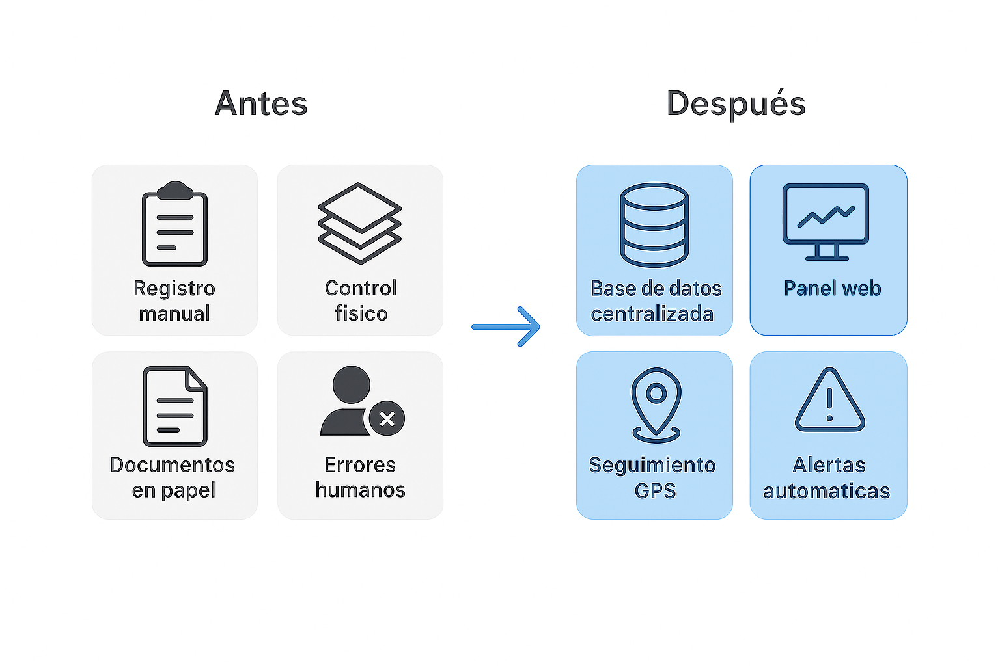
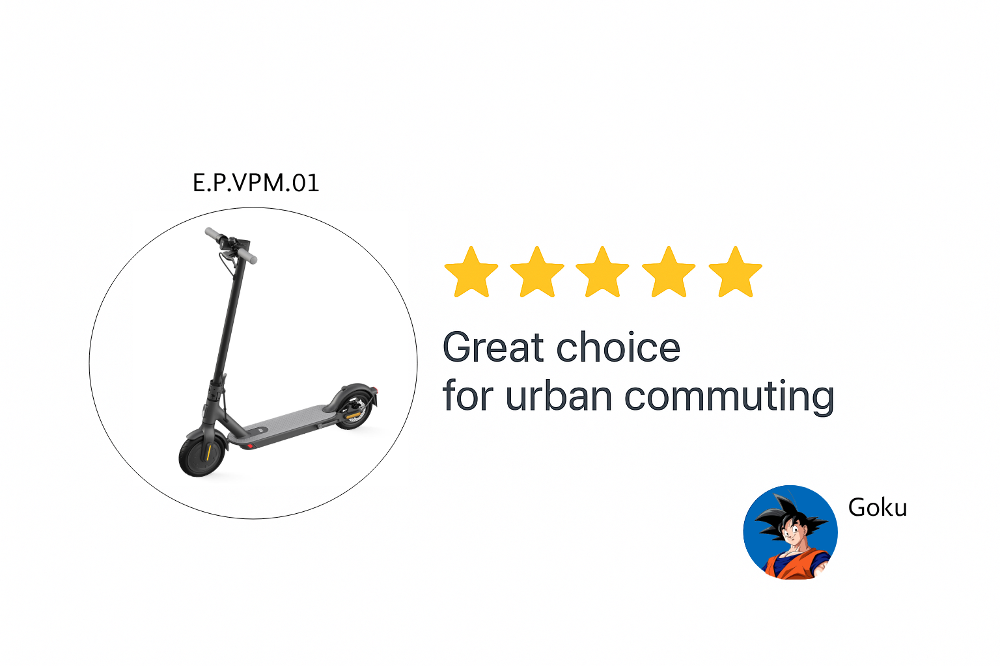
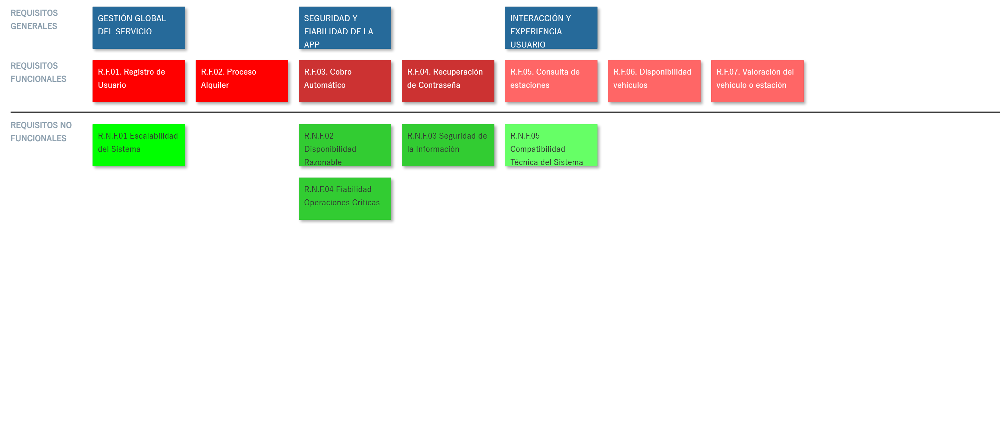

# Título Proyecto

## Miembros del grupo L6-VVF2245

1. Flores Cañabate, Julián
1. Hernández Cuadrado, Luis
1. Noguera Talavera, Sergio
1. Bader Abuhar, Morad

## 1. Introducción al problema

- Descripción del problema para poner en contexto el proyecto, incluyendo información sobre los clientes y usuarios, la situación actual, problemas, expectativas, etc. Se valorará la presencia de información multimedia (fotos, gráficos, documentos escaneados, etc.).

EasyVPM es una empresa dedicada al alquiler de vehículos de movilidad personal que actualmente gestiona los alquileres de forma manual, mediante papeleo y procesos poco eficientes.
Ante su crecimiento, la empresa busca modernizarse implantando una plataforma centralizada que facilite la gestión de usuarios, vehículos y estaciones.
Además, EasyVPM quiere mejorar su imagen y atraer nuevos clientes mediante una aplicación sencilla, moderna y fácil de usar, que ofrezca una experiencia ágil tanto para la empresa como para los usuarios.

 
<em>Objetivo de EasyVPM</em>

## 2. Glosario de términos

**Incidencia:** Registro de un fallo o anomalía detectada en un vehículo o estación, que requiere revisión o intervención por parte del equipo técnico.   
**Mantenimiento pendiente:** Estado en el que se encuentra un VMP cuando ha alcanzado el nº de kilómetros o viajes definidos entre mantenimientos, indicando que requieren una revisión antes de continuar en servicio.  
**Redistribución:** Movimiento de VMPs entre estaciones para equilibrar la disponibilidad.   
**Reseña:** Evaluación proporcionada por un usuario sobre su experiencia con un vehículo mediante calificación y comentario.   
**Tiempo de espera:** Tiempo mínimo que tiene que pasar entre cada viaje.   
**Tipo de tarifa:** Clasificación del modo de pago, que puede ser por suscripción (mensual, anual) o por pago individual de cada trayecto.   
**VMP (Vehículo de Movilidad Personal):** Medio de transporte ligero, destinado a una sola persona (patinetes, monociclos, etc.).   
**Zona de cobertura:** Área geógrafica dentro de la cual el servicio está disponible y se pueden realizar alquileres. 

 
<em>Estación de EasyVPM</em>

 
<em>Reseña de EasyVPM</em>

## 3. Visión general del sistema

### 3.1. Requisitos generales

#### R.G.01. Gestión global del servicio de movilidad
Como administrador de EasyVPM, 
quiero que el sistema sea capaz de almacenar y gestionar la información relacionada con los usuarios, los vehículos alquilados y las estaciones, 
para asegurar una correcta administración del servicio y garantizar su funcionamiento continuo.

#### R.G.02. Seguridad y fiabilidad de la APP
Como administrador de EasyVPM, 
quiero que el sistema sea fiable y seguro incluso ante errores o interrupciones, 
para garantizar la continuidad del servicio, proteger la información y mantener la integridad de las operaciones críticas como los pagos o alquileres.

#### R.G.03. Interacción y satisfacción del usuario
Como cliente de EasyVPM, 
quiero que el sistema ofrezca una interfaz clara y minimalista, con diversas opciones de visualización, 
para utilizar la app sin complicaciones y de manera sencilla.

### 3.2. Usuarios del sistema

El sistema de EasyVPM contará con los siguientes tipos de usuarios: 

**Usuarios(Clientes)**
   * Se registran para alquilar vehículos, consultar estaciones y disponibilidad, iniciar y finalizar alquileres, y proporcionar valoraciones. 

**Administradores**
   * Gestionan usuarios, vehículos y estaciones, supervisan incidencias y mantenimiento, y generan informes para la empresa. 

**Técnicos de mantenimiento**
   * Reciben notificaciones de incidencias y actualizan el estado de los vehículos. 
   
## 4. Catálogo de requisitos

### 4.1. Requisitos funcionales

#### R.F.01. Registro de usuario
Como cliente,  
quiero registrarme en el sistema  
para poder acceder al servicio de alquiler.

**P.A.01.**
Registro de usuario
- El registro solicita nombre, correo y contraseña.
- El sistema verifica que el correo no esté duplicado.
- Se envía un correo de confirmación al completar el registro.
- Se debe aplicar la regla de negocio R.N.04.

#### R.F.02. Proceso de Alquiler
Como cliente,  
quiero alquilar un vehículo desde la aplicación 
para inciar mi viaje sin necesidad de gestiones manuales.

**P.A.02.**
Proceso del alquiler
- Solo se permite iniciar alquiler si hay vehículos disponibles.
- El sistema registra fecha y hora de inicio.
- Se asocia el vehículo y la estación al alquiler.
- Se debe aplicar la regla de negocio R.N.02.

#### R.F.03. Cobro automático
Como administrador,  
quiero que el sistema calcule y cobre automáticamente el importe 
del alquiler según el tiempo de uso,  
para evitar pagos manuales o errores y así mejorar la experiencia 
de usuario.  

**P.A.03.**
Cobro automático
- La aplicacion registra el tiempo en el que se devuelve el vehículo a la estación.
- El sistema calcula a partir de los tiempos registrados el precio a pagar. 
- El sistema permite pagar con tarjeta de crédito o a través de sistemas de pago en línea como PayPal, por ejemplo, desde la aplicación.
Se debe aplicar la regla de negocio R.N.01.

#### R.F.04. Recuperación de contraseña
Como cliente de EasyVPM, 
quiero poder recuperar mi contraseña si la olvido, 
para no perder el acceso a mi cuenta.

**P.A.04.**
Recuperación de contraseña
- El usuario introduce su correo electrónico registrado y recibe un enlace temporal de autenticación.
- El enlace dura solo 24 horas o hasta utilizarlo.
- El sistema obliga al usuario a establecer una nueva contraseña antes de poder a acceder.

#### R.F.05. Consulta de estaciones cercanas
Como cliente,  
quiero ver las estaciones más cercanas a mi ubicación (GPS)  
mediante un servicio de mapas  
para recoger o devolver un vehículo fácilmente.

**P.A.05.**
Consulta de estaciones cercanas
- El sistema muestra estaciones por geolocalización.
- Cada estación muestra cuántos vehículos hay disponibles.
- Si el usuario no permite el acceso a la ubicación, el sistema muestra un mensaje adecuado.
- Se debe aplicar la regla de negocio R.N.02.

#### R.F.06. Disponibilidad de los vehículos
Como cliente,  
quiero ver la cantidad y el tipo de vehículos  
que hay en cada estación,  
para poder seleccionar el mejor vehículo disponible  
para mis necesidades.

**P.A.06.**
Disponibilidad de los vehículos
- El usuario puede ver cuántos vehículos hay en cada estación y de qué tipo (bicicletas, scooters, etc.).
- Los datos de disponibilidad se actualizan en tiempo real.
- Se debe aplicar la regla de negocio R.N.06.

#### R.F.07. Valoración del vehículo o estación
Como administrador de EasyVPM, 
quiero que los clientes puedan poner valoración al vehículo o estación, 
para poder conocer el estado real del servicio, detectar posibles incidencias y ayudar a mejorar el funcionamiento del servicio.

**P.A.07.**
Valoración del vehículo o estación
- Al finalizar el alquiler la aplicación ofrece la opción de valorar el vehículo o poner algún comentario (por ejemplo, de 1 a 5 estrellas con comentario opcional).
- El sistema registra la valoración junto al identificador del usuario, vehículo o estación y la fecha.
- Las valoraciones bajas (por ejemplo 1 o 2 estrellas) y con comentario, explicando la incidencia o el porqué de la baja puntuación, se marcan automáticamente para revisión.  
(*El comentario es necesario porque no vas a movilizar a un trabajador solo porque a algún gracioso le apetezca poner mala valoración*)
- Si un vehículo o estación recibe varias valoraciones bajas y sin comentarios se marca automáticamente para revisión (varias personas opinan que no está muy bien y por lo tanto se revisa).

### 4.1.1. Requisitos de información

#### R.I.01. Información para la gestión administrativa
Como administrador de EasyVPM,  
quiero acceder a información sobre el uso de los vehículos,  
las estaciones, los ingresos y las incidencias,  
para poder gestionar la empresa de manera eficiente y  
tomar decisiones sobre expansión, mantenimiento y calidad del servicio.

**P.A.01.**
Gestión de información de usuarios, vehículos y estaciones(administrador)
- Se puede registrar, editar y penalizar usuarios, vehículos y estaciones.
- Los datos modificados se reflejan inmediatamente en el sistema.
- No se permite duplicar registros con el mismo identificador.

#### R.I.02. Información para el usuario
Como usuario de EasyVPM,  
quiero recibir informacion sobre las características  
de los vehiculos y sus respectivas reseñas,  
y mi historial de alquileres,  
para planificar mis desplazamientos y tomar decisiones informadas.

**P.A.02.**
Consulta de vehículos
- El sistema muestra una descripción técnica del vehículo seleccionado.
- El sistema muestra diversas reseñas así como un porcentaje de satisfacción general del vehículo.
- El sistema muestra en el perfil el historial de alquileres.

#### R.I.03. Información para el mantenimiento
Como tecnico de mantenimiento de EasyVPM,
quiero recibir informacion sobre inicidencias reportadas y el estado de los vehiculos,
para saber de que vehículos o estaciones me tengo que encargar.

**P.A.03.**	
Registro y gestión de incidencias/mantenimiento	
- Los usuarios pueden reportar una incidencia durante o después del alquiler.
- Los técnicos reciben la notificación y pueden actualizar el estado del vehículo (por ejemplo: “En mantenimiento", “Reparado”).

### 4.1.2. Reglas de negocio

#### R.N.01. No eliminar usuarios que tengan alquiler activo
Como administrador de EasyVPM,  
quiero que el cliente no pueda eliminar su cuenta de la aplicación 
mientras esté alquilando un vehículo, 
para asegurar la devolución del vehículo y el registro del pago.

**P.A.01.**
No eliminar usuarios que tengan alquiler activo
- Un cliente registrado sin alquileres activos puede eliminar su cuenta perfectamente desde la aplicación o la página web.
- A un cliente registrado que quiera eliminar su cuenta teniendo alquilado un VMP no se le permitirá la opción de eliminar su cuenta desde ningún sitio hasta que finalize el alquiler y se devuelva el vehículo.

#### R.N.02. Evitar que los usuarios alquilen 2 vehículos simultáneamente
Como administardor de EasyVPM,  
quiero que el cliente no pudea alquilar más de un vehículo a la vez, 
para evitar la falta de disponibilidad de vehículos.

**P.A.02.**
Evitar que los usuarios alquilen 2 vehículos simultáneamente
- Un cliente puede alquilar un VMP si no tiene activo ninguno y no se recibe mensaje de error.
- Un cliente al intentar alquilar un VMP teniendo uno ya activo recibe un mensaje de prestámo invalido por superar el número de vehículos alquilados permitido.

#### R.N.03. Mantenimiento obligatiorio  
Como administrador de EasyVPM, 
quiero que todos los vehículos que hayan superado 
50 alquileres o 500 km recorridos deben pasar por revisión, 
para asegurar la seguridad y calidad del servicio.

**P.A.03.**
Mantenimiento obligatiorio
- Cada vez que un cliente finalize un alquiler, se registrará el uso de ese VMP, asi como los kilometros realizados, y se sumarán al total de usos y kilometros de ese vehículo.
- Cuando se supere los 50 usos o 500 km se cambiará el estado del VMP (estado: mantenimiento pendiente) y se avisará a los técnicos de mantenimiento para que revisen el VMP. Después, se reiniciará el número de usos y kilometros y volverá a estar disponible.

#### R.N.04. Edad mínima obligatoria  
Como administrador de EasyVPM, 
quiero que solo los usuarios mayores de 12 años 
puedan utilizar EasyVPM y alquilar un vehiculo 
para garantizar la seguridad de los menores.

**P.A.04.**
Edad mínima obligatoria
- Cuando los usuarios se registran por primera vez en EasyVPM, se les pedirá que indiquen su edad.
- Si el usuario tiene más de 12 años, la creación de la cuenta será un éxito y se le informará.
- Si el usuario tiene 12 años o menos, saldrá un mensaje de error donde se indica que no se pudo crear la cuenta porque no se cumple la edad mínima de uso de EasyVPM.

#### R.N.05. Cambio de estado vehículo  
Como administrador de EasyVPM, 
quiero que el sistema cambie automáticamente el estado de los vehículos, 
para que el cliente y el técnico de mantenimiento sepa desde la app cómo se encuentran los vehículos.

**P.A.05.**
Cambio de estado vehículo
- Si un vehículo se encuentra en buen estado aparacerá como "disponible" desde que su último usuario lo coloque en una estación.
- Si un vehículo está en mal estado aparecerá como "averiado" desde que lo informe un trabajador o cliente.
- Si un vehículo está en uso aparecerá como "en uso" desde que alguien lo alquile.
- Si un vehículo alcanza los 50 alquileres o 500 km aparecerá como "mantenimiento pendiente".
- Si un técnico de mantenimiento se lleva un vehículo aparece como "en mantenimiento".
- Si un vehículo está en el almacen tras haberse reparado y está esperando que sea redistribuido aparece como "reparado".

#### R.N.06. Cambio de estado estación  
Como administrador de EasyVPM, 
quiero que el sistema cambie automáticamente el estado de las estaciones, 
para que el cliente y el técnico de mantenimiento sepa desde la app en qué estado se encuentran las estaciones.

**P.A.06.**
Cambio de estado estación.
- Si una estación se encuentra libre aparece como "libre" desde que alguien desengancha un vehículo de dicha estación.
- Si una estación se encuentra ocupada aparece como "ocupada" desde que alguien enganche un vehículo en ella.
- Si una estación se estropea o hay algún motivo temporal que afecta a la zona (por ejemplo hay celebración con carrozas y prohíben la circulación de VMPs) la estación aparece como "fuera de servicio".

#### R.N.07. Control de roles y permisos  
Como administrador de EasyVPM, 
quiero que el sistema tenga definido de forma clara los permisos de acceso según el tipo de usuario,
para evitar que haya accesos indebidos a funciones críticas.

**P.A.07.**
Control de roles y permisos
- Los clientes solo pueden acceder a funciones de consulta (estaciones, disponibilidad, historial) y alquiler.
- Los administradores pueden gestionar todo el sistema.
- Los técnicos solo pueden visualizar y actualizar el estado de incidencias o mantenimiento de vehículos.
- Cualquier intento de acceder a una función no permitida debe mostrar un mensaje de "Acceso no autorizado".

### 4.2. Mapa de historias de usuario (opcional)

 

### 4.3. Requisitos no funcionales (opcional)

#### R.N.F.01. Escalabilidad del sistema
Como administrador de EasyVPM,  
quiero que el sistema permita incorporar hasta 1000 usuarios y vehículos simúltaneos  
para poder ampliar el servicio sin afectar el rendimiento del sistema.

**P.A.01.**
Escalabilidad del sistema
- Registrar nuevos usuarios y verificar que pueden acceder y utilizar todas sus funciones.
- Añadir nuevos vehículos y comprobar que se pueden registrar y alquilar correctamente.
- Simular un incremento significativo de usuarios activos y comprobar que no provoque un fallo en el sistema y que el rendimiento de este sigue siendo aceptable.

#### R.N.F.02. Disponibilidad razonable  
Como cliente de EasyVPM,  
quiero que la aplicación este disponible en todo momento,  
para poder acceder al servicio sin interrupciones y aprovecharla al máximo.

**P.A.02.**
Disponibilidad razonable
- La aplicación debe estar disponible al menos el 90% del tiempo (exceptuando mantenimientos).
- Comprobar que la aplicación se puede acceder en distintos momentos del día.
- Simular simultaneidad de accesos de distintos usuarios para verificar que el sistema permanece operativo.
- Intentar acceder al sistema durante un mantenimiento programado y comprobar que se muestra el correspondiente aviso.

#### R.N.F.03. Seguridad de la información
Como administrador de EasyVPM,  
quiero que los datos de usuarios, pagos y vegículos estén protegidos, 
para cumplir con la normativa de protección de datos y evitar accesos no autorizados.

**P.A.03.**
Seguridad de la información
- Intentar acceder al sistema con un usuario no registrado y comprobar que el acceso es denegado.
- Intentar acceder al sistema con un usuario registrado, pero sin permisos suficientes y comprobar que no puede realizar acciones restringidas.
- Verificar que los datos sensibles (como credenciales y métodos de pago) están cifrados y no pueden leerse directamente desde la base de datos.
- Comprobar que todos los intentos de acceso (exitosos y fallidos) queden registrados, diferenciando los legítimos de los fraudulentos.
- Los datos sensibles (pagos, correos, etc.) se transmiten por HTTPS.
- Intentar acceder a una función restringida muestra un mensaje de “Acceso no autorizado”.

#### R.N.F.04. Fiabilidad operaciones críticas
Como cliente de EasyVPM,  
quiero que las funciones críticas como el registro del pago funcionen correctamente,  
para confiar en el sistema y evitar errores o pérdidas de datos.

**P.A.04.**
Fiabilidad operaciones críticas
- En caso de error durante el pago o el alquiler, el sistema debe mostrar un mensaje claro.
- Verificar que los registros de alquiler, inicio y fin de viaje se guardan correctamente aun en caso de interrupción de red.
- Las operaciones completadas deben quedar registradas en el sistema sin duplicados.

#### R.N.F.05. Compatibilidad técnica del sistema
Como responsable TIC de EasyVPM,  
quiero que el sistema funcione correctamente en distintos entornos (Android, iOS y navegadores web modernos),  
para asegurar la accesibilidad del servicio a la mayoría de usuarios.

**P.A.05.**
Compatibilidad técnica del sistema
- La app debe ser usable desde Android (versión 11 o superior) e iOS (versión 14 o superior).
- Debe tener accesi funcional básico desde navegadores web modernos (Chrome, Edge, Safari, Firefox).
- Verificar que los usuarios pueden iniciar sesión, alquilar vehículos y consultar estaciones sin ningún problema desde estas plataformas.
- Las pantallas deben adaptarse a distintos tamaños de dispositivos.

-- fin entregable 1 --

## 5. Modelo conceptual

### 5.1. Diagramas de clases UML

- con restricciones.

### 5.2. Escenarios de prueba

- con descripción textual y diagrama de objetos UML.

## 6. Matrices de trazabilidad

- Matriz de trazabilidad entre los elementos del modelo conceptual y los requisitos.

|       | EntidadX   | AsociaciónX  | RestricciónX  | Entidad2 ...   | 
|:------|:-----------|:-----------|:-----------|:-----------|
| RI-1  | X          | X          | X          | X          |
| RI-2  |            | X          |            | X          |
| RF-1  |            | X          |            | X          |
| RF-2  | X          |            | X          | X          |
| RN-1  |            | X          |            |            |
| RN-2  | X          | X          | X          |            |
| ...   |            |            |            |            |

-- fin entregable 2 --

## 7. Modelo relacional en 3FN

- Relaciones obtenidas al aplicar la transformación del modelo conceptual.

### 7.1.  Justificación de la estrategia de transformación de jerarquías

- si se identificaron jerarquías en el MC.

### 8. Matriz de trazabilidad MC/SQL (opcional):

- Restricciones sobre el MC / Elementos del modelo tecnológico (SQL) (Triggers, checks, etc.)
- Incluir Reglas de negocio — Constraints/Triggers en las matrices de trazabilidad para el entregable 3

|       | EntidadX   | AsociaciónX  | RestricciónX  | Entidad2 ...   | 
|:-------|:-------|:-------|:-------|:-------|
| TABLA-1 |        |        |        |        |
| TABLA-2 |        |        |        |        |
| TABLA-3 |        |        |        |        |
| TABLA-4 |        |        |        |        |
| TRIG-1 |        |        |        |        |
| TRIG-2 | X      | X      |        | X      |
| TRIG-3 |        | X      |        | X      |
| TRIG-4 |        |        | X      |        |
| CONST-1 |        |        |        |        |
| CONST-2 | X      | X      |        | X      |
| CONST-3 |        | X      |        | X      |
| CONST-4 |        |        | X      |        |

Se consideran todo tipo de constraints declarativas (aquellas definidas durante el CREATE TABLE).
-- fin entregable 3 --

## Referencias

