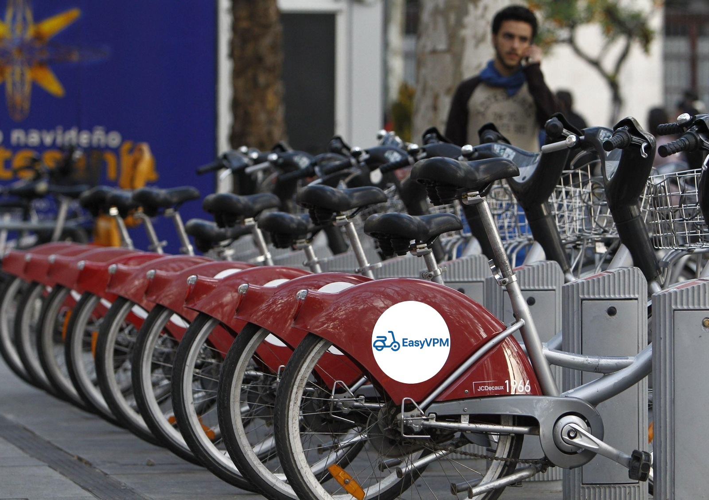

# Título Proyecto

## Miembros del grupo L6-VVF2245

1. Flores Cañabate, Julián
1. Hernández Cuadrado, Luis
1. Noguera Talavera, Sergio
1. Bader Abuhar, Morad

## 1. Introducción al problema

- Descripción del problema para poner en contexto el proyecto, incluyendo información sobre los clientes y usuarios, la situación actual, problemas, expectativas, etc. Se valorará la presencia de información multimedia (fotos, gráficos, documentos escaneados, etc.).

La empresa EasyVPM, dedicada al alquiler y gestión de vehículos de movilidad personal como patinetes eléctricos, bicicletas y monociclos, ha contactado con nuestro equipo para desarrollar una plataforma centralizada que optimice su gestión logística y administrativa.

Ante la futura expansión y apertura de nuevas sucursales, la empresa ha detectado que la documentación manual ya no resulta eficiente, pues dificulta el control del inventario, el seguimiento de los vehículos, la trazabilidad de los alquileres y la supervisión del mantenimiento.

En consecuencia, EasyVPM considera imprescindible implantar un sistema de informacion que permita un acceso ágil y seguro a grandes volúmenes de información, mejorando sus procesos internos. Con esta plataforma, la empresa busca modernizar su infraestructura, optimizar la toma de decisiones y ofrecer una experiencia de usuario más completa y satisfactoria.

 
<em>Estación de EasyVPM</em>

## 2. Glosario de términos

- Términos específicos del dominio del problema, ordenados alfabéticamente. Se valorará la presencia de información multimedia.

**Cliente:** Persona que realiza el alquiler de un VMP a través de la plataforma.  
**Duración del viaje:** Tiempo que pasa entre el inicio y el fin del alquiler.  
**Estación:** Punto físico donde se pueden recoger o devolver los vehículos.   
**Estado de la estación:** Condición actual de la estación (libre, ocupada, fuera de servicio).   
**Estado del vehículo:** Condición actual del VMP (disponible, en uso, averiado, mantenimiento pendiente, en mantenimiento, reparado).   
**Inventario:** Conjunto de VMP disponibles para alquiler.  
**Incidencia** Registro de un fallo o anomalía detectada en un vehículo o estación, que requiere revisión o intervención por parte del equipo técnico.   
**Mantenimiento:** Conjunto de acciones para reparar o revisar los vehículos o las estaciones.   
**Mantenimiento pendiente:** Estado en el que se encuentra un VMP cuando ha alcanzado el nº de kilómetros o viajes definidos entre mantenimientos, indicando que requieren una revisión antes de continuar en servicio.  
**Redistribución:** Movimiento de VMPs entre estaciones para equilibrar la disponibilidad. #(lo de entre estaciones se puede omitir si queremos usar esta palabra para sacar los vehiculos del taller)   
**Reparado:** Estado en el que se encuentra un vehículo cuando su mantenimiento ha terminado y se tiene que redistribuir.  
**Reseña** Evaluación proporcionada por un usuario sobre su experiencia con un vehículo mediante calificación y comentario.   
**Tiempo de espera:** Tiempo mínimo que tiene que pasar entre cada viaje.   
**Tipo de tarifa:** Clasificación del modo de pago, que puede ser por suscripción (mensual, anual) o por pago individual de cada trayecto.   
**VMP (Vehículo de Movilidad Personal):** Medio de transporte ligero, destinado a una sola persona (patinetes, monociclos, etc.).   

## 3. Visión general del sistema

### 3.1. Requisitos generales
El sistema debe ser capaz de almacenar y gestionar la información relacionada con los usuarios, los vehículos alquilados y las estaciones, permitiendo así una correcta administración de los préstamos y del servicio ofrecido.

Para ello deberá informar al usuario sobre las estaciones más cercanas a su ubicación y mostrar la cantidad y tipo de vehículos disponibles en cada una de ellas, además de tener que gestionar automáticamente los procesos de alquiler y cobro, controlar el acceso según roles de usuario, permitir el registro de incidencias y mantenimiento, y generar informes y estadísticas para la toma de decisiones empresariales.

Finalmente, el sistema deberá registrar la ubicación del vehículo alquilado en tiempo real, con el fin de garantizar su trazabilidad y evitar pérdidas o extravíos. 

### 3.2. Usuarios del sistema

El sistema de EasyVPM contará con los siguientes tipos de usuarios: 

**Usuarios(Clientes)**
   * Se registran para alquilar vehículos, consultar estaciones y disponibilidad, iniciar y finalizar alquileres, y proporcionar valoraciones. 

**Administradores**
   * Gestionan usuarios, vehículos y estaciones, supervisan incidencias y mantenimiento, y generan informes para la empresa. 

**Técnicos de mantenimiento**
   * Reciben notificaciones de incidencias y actualizan el estado de los vehículos. 
   
## 4. Catálogo de requisitos

### 4.1. Requisitos funcionales

#### R.F.01 Registro de usuario
Como cliente,  
quiero registrarme en el sistema  
para poder acceder al servicio de alquiler.

#### R.F.02 Consulta de estaciones cercanas
Como cliente,  
quiero ver las estaciones más cercanas a mi ubicación  
para saber dónde puedo alquilar un vehículo.

#### R.F.03 Inicio de alquiler
Como cliente,  
quiero iniciar un alquiler  
para usar un vehículo disponible.

#### R.F.04 Gestión administrativa del sistema
Como administrador,  
quiero gestionar los usuarios, estaciones y vehículos  
para mantener actualizado el sistema.

#### R.F.05 Generación de informes
Como administrador,  
quiero generar informes de uso y mantenimiento  
para tomar decisiones basadas en datos.

#### R.F.06 Notificación de incidencias
Como técnico de mantenimiento,  
quiero recibir notificaciones de incidencias  
para poder revisar y reparar los vehículos afectados.

**Prueba de aceptación**
- Descripción de la primera comprobación a realizar
- Descripción de la segunda comprobación a realizar
- Se debe aplicar la regla de negocio R.N.XX.
- ...

**P.A.01.**
- El registro solicita nombre, correo y contraseña.
- El sistema verifica que el correo no esté duplicado.
- Se envía un correo de confirmación al completar el registro.

**P.A.02.**
- El sistema muestra estaciones ordenadas por cercanía.
- Cada estación muestra cuántos vehículos hay disponibles.

**P.A.03.**
- Solo se permite iniciar alquiler si hay vehículos disponibles.
- El sistema registra fecha y hora de inicio.
- Se asocia el vehículo y la estación al alquiler.

**P.A.04.**
- Administrador puede crear, modificar o eliminar registros.
- Los cambios se reflejan de inmediato.
- El sistema impide eliminar registros vinculados a alquileres activos.

**P.A.05.**
- El sistema muestra una lista de incidencias nuevas.
- El técnico puede actualizar el estado.

**P.A.06.**
- El sistema genera informes de manera automática.
- Los informes son descargables en formato PDF.
- Los datos reflejan correctamente las operaciones registradas.

### 4.1.1. Requisitos de información

#### R.I.01. Información para la gestión administrativa
Como administrador de EasyVPM,  
quiero recibir información sobre el uso de los vehículos,  
las estaciones, los ingresos y las incidencias,  
para poder gestionar la empresa de manera eficiente y  
tomar decisiones sobre expansión, mantenimiento y calidad del servicio.

#### R.I.02. Información para el usuario
Como usuario de EasyVPM,  
quiero recibir informacion sobre las estaciones cercanas y  
la disponibilidad de los vehiculos, iniciar y finalizar alquileres y publicar valoraciones. ###### esto del final no es de información ######

#### R.I.03. Información para el mantenimiento
Como tecnico de mantenimiento de EasyVPM,
quiero recibir informacion sobre inicidencias y el estado de los vehiculos
para saber de que vehículos/ estaciones me tengo que encargar.

**Prueba de aceptación**

**P.A.01.**
Gestión de información de usuarios, vehículos y estaciones(administrador)
- Se puede registrar, editar y eliminar usuarios, vehículos y estaciones.
- Los datos modificados se reflejan inmediatamente en el sistema.
- No se permite duplicar registros con el mismo identificador.

**P.A.02.**
Consulta de estaciones cercanas
- El sistema muestra un listado de estaciones ordenadas por proximidad a la ubicación actual del usuario.
- Si el usuario no permite el acceso a la ubicación, el sistema muestra un mensaje adecuado.

**P.A.03.**
Visualización de disponibilidad de vehículos
- El usuario puede ver cuántos vehículos hay en cada estación y de qué tipo (bicicletas, scooters, etc.).
- Los datos de disponibilidad se actualizan en tiempo real.

**P.A.04.**
Proceso automático de alquiler y cobro
- Al iniciar un alquiler, el sistema descuenta un vehículo de la estación correspondiente y registra el préstamo.
- Al finalizar, calcula el monto y genera el cobro automáticamente.
- Si el pago falla, el sistema notifica al usuario.

**P.A.05.**	
Control de acceso por roles
- Los clientes solo pueden acceder a funciones de consulta y alquiler.
- Los administradores pueden gestionar todo el sistema.
- Los técnicos solo pueden ver incidencias y actualizar estados de mantenimiento.
- Intentar acceder a una función restringida muestra un mensaje de “Acceso no autorizado”.
  
**P.A.06.**	
Registro y gestión de incidencias/mantenimiento	
- Los usuarios pueden reportar una incidencia durante o después del alquiler.
- Los técnicos reciben la notificación y pueden actualizar el estado del vehículo (por ejemplo: “En revisión”, “Reparado”).

**P.A.07.**
Generación de informes y estadísticas
- Los administradores pueden generar informes de uso, mantenimiento, ingresos y disponibilidad.
- Los informes pueden descargarse en formato PDF o visualizarse en pantalla.
- Los datos mostrados son consistentes con las operaciones realizadas.

### 4.1.2. Reglas de negocio

#### R.N.01. No eliminar usuarios que tengan alquiler activo.
Como administrador de EasyVPM,  
quiero que el cliente no pueda eliminar su cuenta de la aplicación 
mientras esté alquilando un vehículo, 
para asegurar la devolución del vehículo y el registro del pago.

#### R.N.02. Evitar que los usuarios alquilen 2 vehículos simultáneamente.
Como administardor de EasyVPM,  
quiero que el cliente no pudea alquilar más de un vehículo a la vez, 
para evitar la falta de disponibilidad de vehículos.

#### R.N.03. Mantenimiento obligatiorio.  
Como administrador de EasyVPM, 
quiero que todos los vehículos que hayan superado 
50 alquileres o 500 km recorridos deben pasar por revisión, 
para asegurar la seguridad y calidad del servicio.

#### R.N.04. Edad mínima obligatoria.  
Como administrador de EasyBPM, 
quiero que solo los usuarios mayores de 12 años 
puedan utilizar EasyVPM y alquilar un vehiculo 
para garantizar la seguridad de los menores.

**Prueba de aceptación**

**P.A.01.**
- Un cliente registrado sin alquileres activos puede eliminar su cuenta perfectamente desde la aplicación o la página web.
- A un cliente registrado que quiera eliminar su cuenta teniendo alquilado un VMP no se le permitirá la opción de eliminar su cuenta desde ningún sitio hasta que finalize el alquiler y se devuelva el vehículo.

**P.A.02.**
- Un cliente puede alquilar un VMP si no tiene activo ninguno y no se recibe mensaje de error.
- Un cliente al intentar alquilar un VMP teniendo uno ya activo recibe un mensaje de prestámo invalido por superar el número de vehículos alquilados permitido.

**P.A.03**
- Cada vez que un cliente finalize un alquiler, se registrará el uso de ese VMP, asi como los kilometros realizados, y se sumarán al total de usos y kilometros de ese vehículo.
-Cuando se supere los 50 usos o 500 km se cambiará el estado del VMP (estado: mantenimiento pendiente) y se avisará a los técnicos de mantenimiento para que revisen el VMP. Después, se reiniciará el número de usos y kilometros y volverá a estar disponible.

**P.A.04**
- Cuando los usuarios se registran por primera vez en EasyVPM, se les pedirá que indiquen su edad.
- Si el usuario tiene más de 12 años, la creación de la cuenta será un éxito y se le informará.
- Si el usuario tiene 12 años o menos, saldrá un mensaje de error donde se indica que no se pudo crear la cuenta porque no se cumple la edad mínima de uso de EasyVPM.

### 4.2. Mapa de historias de usuario (opcional)

### 4.3. Requisitos no funcionales (opcional)

#### R.N.F.01. Disponibilidad 24/7.  
Como cliente de EasyVPM,  
quiero que la aplicación este disponible en todo momento,  
para poder acceder al servicio sin interrupciones y aprovecharla al máximo.

#### R.N.F.02. Escalabilidad del sistema.
Como administrador de EasyVPM,  
quiero que el sistema permita incorporar más estaciones, usuarios y vehículos en el futuro,  
para poder ampliar el servicio sin afectar el rendimiento del sistema.

#### R.N.F.03. Seguridad de la información.
Como administrador de EasyVPM,  
quiero que solo usuarios registrados y autorizados puedan acceder al sistema,  
para garantizar la seguridad de la información y cumplir con la ley de protección de datos.

#### R.N.F.04. Fiabilidad del servicio.
Como cliente de EasyVPM,  
quiero que las funciones críticas como el registro del pago funcionen correctamente,  
para confiar en el sistema y evitar errores o pérdidas de datos.

#### R.N.F.05. Compatibilidad técnica del sistema.
Como responsable TIC de EasyVPM,  
quiero que el sistema funcione correctamente en distintos entornos (Android, iOS y navegadores web modernos),  
para asegurar la accesibilidad del servicio a todos los usuarios.

**Prueba de aceptación**

**P.A.01.**
Disponibilidad 24/7
- Comprobar que la aplicación se puede acceder en distintos momentos del día.
- Simular simultaneidad de accesos de distintos usuarios para verificar que el sistema permanece operativo.
- Intentar acceder al sistema durante un mantenimiento programado y comprobar que se muestra el correspondiente aviso.

**P.A.02.**
Escalabilidad del sistema
- Añadir nuevas estaciones al sistema y comprobar que se visualizan correctamente en la app y base de datos.
- Registrar nuevos usuarios y verificar que pueden acceder y utilizar todas sus funciones.
- Añadir nuevos vehículos y comprobar que se pueden registrar y alquilar correctamente.
- Simular un incremento significativo de usuarios activos y comprobar que no provoque un fallo en el sistema y que el rendimiento de este sigue siendo aceptable.

**P.A.03.**
Seguridad de la información
- Intentar acceder al sistema con un usuario no registrado y comprobar que el acceso es denegado.
- Intentar acceder al sistema con un usuario registrado, pero sin permisos suficientes y comprobar que no puede realizar acciones restringidas.
- Verificar que los datos de usuario y pago están cifrados y no se puede leer desde la base de datos sin autorización.
- Comprobar que todos los intentos de acceso queden registrados y diferenciar los legítimos de los fraudulentos.

**P.A.04.**
Fiabilidad del servicio
- Realizar un pago de alquiler y comprobar que se registra correctamente en la base de datos y se refleja en el historial del usuario.
- Simular un fallo durante el proceso de pago y comprobar que se genera un mensaje de error adecuado y no se pierden datos.
- Verificar que los registros de alquiler, inicio y fin de viaje se guardan correctamente aun en caso de interrupción de red.

**P.A.05.**
Compatibilidad técnica del sistema
- Acceder a la aplicación desde un dispositivo Android y comprobar que todas las funciones principales funcionan correctamente.
- Acceder a la aplicación desde un dispositivo iOS y comprobar que todas las funciones principales funcionan correctamente.
- Acceder a la aplicación desde navegadores web modernos (Safari, Chrome, Firefox) y comprobar que todas las funciones principales funcionan correctamente.
- Verificar que los usuarios pueden iniciar sesión, alquilar vehículos y consultar estaciones sin ningún problema desde cualquier plataforma.

-- fin entregable 1 --

## 5. Modelo conceptual

### 5.1. Diagramas de clases UML

- con restricciones.

### 5.2. Escenarios de prueba

- con descripción textual y diagrama de objetos UML.

## 6. Matrices de trazabilidad

- Matriz de trazabilidad entre los elementos del modelo conceptual y los requisitos.

|       | EntidadX   | AsociaciónX  | RestricciónX  | Entidad2 ...   | 
|:------|:-----------|:-----------|:-----------|:-----------|
| RI-1  | X          | X          | X          | X          |
| RI-2  |            | X          |            | X          |
| RF-1  |            | X          |            | X          |
| RF-2  | X          |            | X          | X          |
| RN-1  |            | X          |            |            |
| RN-2  | X          | X          | X          |            |
| ...   |            |            |            |            |

-- fin entregable 2 --

## 7. Modelo relacional en 3FN

- Relaciones obtenidas al aplicar la transformación del modelo conceptual.

### 7.1.  Justificación de la estrategia de transformación de jerarquías

- si se identificaron jerarquías en el MC.

### 8. Matriz de trazabilidad MC/SQL (opcional):

- Restricciones sobre el MC / Elementos del modelo tecnológico (SQL) (Triggers, checks, etc.)
- Incluir Reglas de negocio — Constraints/Triggers en las matrices de trazabilidad para el entregable 3

|       | EntidadX   | AsociaciónX  | RestricciónX  | Entidad2 ...   | 
|:-------|:-------|:-------|:-------|:-------|
| TABLA-1 |        |        |        |        |
| TABLA-2 |        |        |        |        |
| TABLA-3 |        |        |        |        |
| TABLA-4 |        |        |        |        |
| TRIG-1 |        |        |        |        |
| TRIG-2 | X      | X      |        | X      |
| TRIG-3 |        | X      |        | X      |
| TRIG-4 |        |        | X      |        |
| CONST-1 |        |        |        |        |
| CONST-2 | X      | X      |        | X      |
| CONST-3 |        | X      |        | X      |
| CONST-4 |        |        | X      |        |

Se consideran todo tipo de constraints declarativas (aquellas definidas durante el CREATE TABLE).
-- fin entregable 3 --

## Referencias

